# ACMS Monitor — Cell Execution Sequence

**Mind Over Metadata LLC — Peter Heller**
`QCadjunct/acms-langgraph-poc` · `ui/acms_monitor.py`

---

## Overview

The ACMS Monitor is a [Marimo](https://marimo.io) reactive notebook. It is **not** a script that
runs top-to-bottom. Marimo builds a **Directed Acyclic Graph (DAG)** from cell function signatures:
each cell's parameters declare its dependencies, and its return tuple declares what it provides
downstream. Any change to a widget or data source triggers only the affected subgraph — not the
entire notebook.

The architecture enforces two invariants across every panel:

| Rule | Enforcement |
|------|-------------|
| **CREATE / READ separation** | Widgets are instantiated in one cell; `.value` is read in the next |
| **DuckDB empty-frame guard** | `register()` is always preceded by `is_empty()` check |

---

## Full Notebook Sequence Diagram

```mermaid
sequenceDiagram
    autonumber

    participant U  as User / Browser
    participant MO as _mo
    participant IM as _imports
    participant HD as _header
    participant CT as _controls
    participant LD as _load_data
    participant LDR as loader.py
    participant KP as _kpis
    participant P1W as _p1_widgets
    participant P1D as _p1_data
    participant P1  as _panel1
    participant P2W as _p2_widgets
    participant P2D as _p2_data
    participant P2  as _panel2
    participant P3W as _p3_widget
    participant P3  as _panel3
    participant AS as _assemble
    participant RN as _render

    note over MO,IM: ── Bootstrap ──────────────────────────────
    MO  ->> MO  : import marimo as mo
    MO  -->> IM : mo
    IM  ->> IM  : import duckdb, polars, pandas
    IM  ->> IM  : from ui.data.loader import load_sessions,<br/>load_registry, sessions_to_df,<br/>entries_to_df, skill_records_to_df,<br/>using_live_db
    IM  -->> HD : mo, using_live_db
    IM  -->> CT : mo
    IM  -->> LD : load_sessions, load_registry,<br/>sessions_to_df, entries_to_df,<br/>skill_records_to_df
    IM  -->> KP : mo, pl
    IM  -->> P1W: mo
    IM  -->> P1D: duckdb, pd, pl
    IM  -->> P2W: mo
    IM  -->> P2D: duckdb, pd, pl
    IM  -->> P3W: mo
    IM  -->> P3 : mo

    note over HD: ── Header ─────────────────────────────────
    HD  ->> LDR : using_live_db()
    LDR -->> HD : bool (env var check)
    HD  ->> HD  : Build mo.vstack([title, subtitle, callout])
    HD  -->> RN : header

    note over CT: ── Global Controls (CREATE only) ──────────
    CT  ->> CT  : mo.ui.slider → session_count
    CT  ->> CT  : mo.ui.number → mock_seed
    CT  ->> CT  : mo.ui.button → refresh_btn
    CT  -->> LD : session_count, mock_seed, refresh_btn
    CT  -->> RN : session_count, mock_seed, refresh_btn

    note over LD,LDR: ── Data Load (READ .value) ────────────────
    U   ->> CT  : Adjust slider / seed / click Refresh
    CT  -->> LD : widget objects (DAG re-fires _load_data)
    LD  ->> LD  : READ refresh_btn.value  [reactive trigger]
    LD  ->> LD  : READ session_count.value → _n
    LD  ->> LD  : READ mock_seed.value    → _s
    LD  ->> LDR : load_sessions(count=_n, seed=_s)
    LDR -->> LD : sessions  [list of dicts]
    LD  ->> LDR : load_registry(seed=_s)
    LDR -->> LD : registry  [dict]
    LD  ->> LDR : sessions_to_df(sessions)
    LDR -->> LD : session_df  [Polars DataFrame]
    LD  ->> LDR : entries_to_df(sessions)
    LDR -->> LD : entry_df   [Polars DataFrame]
    LD  ->> LDR : skill_records_to_df(registry)
    LDR -->> LD : skill_df   [Polars DataFrame]
    LD  -->> KP : session_df, entry_df
    LD  -->> P1D: session_df, entry_df
    LD  -->> P2W: skill_df
    LD  -->> P2D: skill_df, registry
    LD  -->> P3W: sessions
    LD  -->> P3 : sessions

    note over KP: ── KPI Bar ────────────────────────────────
    KP  ->> KP  : pl.col("status") == "completed" → _comp
    KP  ->> KP  : pl.col("is_failed") == True     → _fail
    KP  ->> KP  : pl.col("status") == "retried"   → _ret
    KP  ->> KP  : session_df["total_ms"].mean()   → _avg
    KP  ->> KP  : (_fail / _tot * 100)            → _rate
    KP  ->> KP  : mo.hstack([6 × mo.stat()])
    KP  -->> RN : kpis

    note over P1W,P1: ── Panel 1: Audit Trail Explorer ──────────
    P1W ->> P1W : mo.ui.dropdown → p1_status
    P1W ->> P1W : mo.ui.dropdown → p1_mode
    P1W ->> P1W : mo.ui.multiselect → p1_agents
    P1W -->> P1D: p1_status, p1_mode, p1_agents
    P1W -->> P1 : p1_status, p1_mode, p1_agents

    U   ->> P1W : Change Status / Mode / Agent filter
    P1W -->> P1D: (DAG re-fires _p1_data)
    P1D ->> P1D : READ p1_status.value → filter session_df
    P1D ->> P1D : READ p1_mode.value   → filter session_df
    P1D ->> P1D : READ p1_agents.value → filter entry_df
    P1D ->> P1D : Guard: entry_df.is_empty()?
    alt entry_df not empty
        P1D ->> P1D : duckdb.connect()
        P1D ->> P1D : register("e", entry_df.to_arrow())
        P1D ->> P1D : SELECT agent_type, AVG(duration_ms) → _dur
        P1D ->> P1D : SELECT status, COUNT(*) → _sts
        P1D ->> P1D : duckdb.close()
    else entry_df empty
        P1D ->> P1D : Empty DataFrames with named columns
    end
    P1D ->> P1D : .to_pandas() → p1_sess_pd, p1_entr_pd,<br/>p1_dur_pd, p1_sts_pd
    P1D -->> P1 : p1_sess_pd, p1_entr_pd, p1_dur_pd, p1_sts_pd

    P1  ->> P1  : mo.ui.table(p1_sess_pd)  [Sessions]
    P1  ->> P1  : mo.ui.table(p1_entr_pd)  [Step Entries]
    P1  ->> P1  : mo.ui.table(p1_dur_pd)   [Duration by agent]
    P1  ->> P1  : mo.ui.table(p1_sts_pd)   [Status counts]
    P1  ->> P1  : mo.vstack([heading, filters, tables])
    P1  -->> AS : panel1

    note over P2W,P2: ── Panel 2: Registry Analytics ────────────
    P2W ->> P2W : Extract domain list from skill_df
    P2W ->> P2W : mo.ui.multiselect → p2_domain
    P2W ->> P2W : mo.ui.checkbox   → p2_current
    P2W -->> P2D: p2_domain, p2_current
    P2W -->> P2 : p2_domain, p2_current

    U   ->> P2W : Change domain / current filter
    P2W -->> P2D: (DAG re-fires _p2_data)
    P2D ->> P2D : READ p2_current.value → filter is_current
    P2D ->> P2D : READ p2_domain.value  → filter domain
    P2D ->> P2D : Guard: skill_df.is_empty()?
    alt skill_df not empty
        P2D ->> P2D : duckdb.connect()
        P2D ->> P2D : register("s", skill_df.to_arrow())
        P2D ->> P2D : SELECT domain, COUNT(*), SUM(is_current) → _dom
        P2D ->> P2D : SELECT fqsn, COUNT(*) versions → _ver
        P2D ->> P2D : duckdb.close()
    else skill_df empty
        P2D ->> P2D : Empty DataFrames with named columns
    end
    P2D ->> P2D : registry.get("task_records") → _trecs
    P2D ->> P2D : pl.from_dicts(_trecs) [try/except fallback]
    P2D ->> P2D : .to_pandas() → p2_skill_pd, p2_dom_pd,<br/>p2_ver_pd, p2_task_pd
    P2D -->> P2 : p2_skill_pd, p2_dom_pd, p2_ver_pd, p2_task_pd

    P2  ->> P2  : mo.ui.table(p2_dom_pd)   [Domain summary]
    P2  ->> P2  : mo.ui.table(p2_ver_pd)   [Version history]
    P2  ->> P2  : mo.ui.table(p2_skill_pd) [Skills]
    P2  ->> P2  : mo.ui.table(p2_task_pd)  [Tasks]
    P2  ->> P2  : mo.vstack([heading, filters, tables])
    P2  -->> AS : panel2

    note over P3W,P3: ── Panel 3: Pipeline Dashboard ─────────────
    P3W ->> P3W : Build _opts dict {label: index} from sessions
    P3W ->> P3W : _default = list(_opts.keys())[0]
    P3W ->> P3W : mo.ui.dropdown(value=_default) → p3_select
    P3W -->> P3 : p3_select

    U   ->> P3W : Select session from dropdown
    P3W -->> P3 : (DAG re-fires _panel3)
    P3  ->> P3  : READ p3_select.value → _idx (integer)
    P3  ->> P3  : sessions[_idx] → _s (session dict)
    P3  ->> P3  : Build _mermaid_diagram(_s):
    P3  ->> P3  :   graph TD, START node
    P3  ->> P3  :   For each entry: node[ic:skill\nstatus]
    P3  ->> P3  :   style node fill:{color by status}
    P3  ->> P3  :   sub_entries as stadium nodes -.->
    P3  ->> P3  :   END_NODE
    P3  ->> P3  : mo.stat() × 5  [session cards]
    P3  ->> P3  : mo.mermaid(diagram_string)
    P3  ->> P3  : mo.ui.table(step rows as DataFrame)
    P3  ->> P3  : mo.vstack([heading, select, cards, graph, table])
    P3  -->> AS : panel3

    note over AS,RN: ── Assembly & Render ───────────────────────
    AS  ->> AS  : mo.ui.tabs({Audit Trail, Registry, Pipeline})
    AS  -->> RN : tabs

    RN  ->> RN  : mo.vstack([header, controls, kpis, tabs])
    RN  -->> U  : Rendered page
```



---

## Cell Dependency Map

```
_mo ──────────────────────────────────────────────────────────────────► (mo)
_imports ────────────────────────────────────────────────────────────► (mo, duckdb, pl, pd,
                                                                         load_*, sessions_to_df,
                                                                         entries_to_df,
                                                                         skill_records_to_df,
                                                                         using_live_db)
                   ┌─────────────────────────────────────────────────────────────────────────┐
                   │                                                                         │
_header(mo, using_live_db) ──────────────────────────────────────────► header               │
_controls(mo) ───────────────────────────────────────────────────────► session_count        │
                                                                         mock_seed           │
                                                                         refresh_btn         │
_load_data(session_count, mock_seed, refresh_btn, load_*) ───────────► sessions             │
                                                                         registry            │
                                                                         session_df          │
                                                                         entry_df            │
                                                                         skill_df            │
_kpis(mo, session_df, entry_df, pl) ─────────────────────────────────► kpis                │
                                                                                             │
_p1_widgets(mo) ─────────────────────────────────────────────────────► p1_status           │
                                                                         p1_mode            │
                                                                         p1_agents          │
_p1_data(p1_*, session_df, entry_df, duckdb, pd, pl) ────────────────► p1_sess_pd          │
                                                                         p1_entr_pd         │
                                                                         p1_dur_pd          │
                                                                         p1_sts_pd          │
_panel1(mo, p1_widgets, p1_data) ────────────────────────────────────► panel1 ──────────┐  │
                                                                                         │  │
_p2_widgets(mo, skill_df) ───────────────────────────────────────────► p2_domain        │  │
                                                                         p2_current      │  │
_p2_data(p2_*, skill_df, registry, duckdb, pd, pl) ──────────────────► p2_skill_pd      │  │
                                                                         p2_dom_pd       │  │
                                                                         p2_ver_pd       │  │
                                                                         p2_task_pd      │  │
_panel2(mo, p2_widgets, p2_data) ────────────────────────────────────► panel2 ──────────┤  │
                                                                                         │  │
_p3_widget(mo, sessions) ────────────────────────────────────────────► p3_select        │  │
_panel3(mo, p3_select, sessions) ────────────────────────────────────► panel3 ──────────┤  │
                                                                                         │  │
_assemble(mo, panel1, panel2, panel3) ───────────────────────────────► tabs ────────────┘  │
_render(mo, header, kpis, controls, tabs) ───────────────────────────► [DOM output] ◄──────┘
```

---

## Marimo DAG Rules — Enforced in This Notebook

### Rule 1 — CREATE / READ Separation

Every widget is born in a dedicated `_*_widgets` cell and consumed only in the following `_*_data` cell. This is a hard Marimo constraint: accessing `.value` in the same cell that calls `mo.ui.*()` raises a `RuntimeError`.

```
_p1_widgets  →  CREATE  p1_status, p1_mode, p1_agents   (no .value here)
_p1_data     →  READ    p1_status.value, p1_mode.value   (filter logic here)
_panel1      →  RENDER  widgets + data into mo.vstack
```

### Rule 2 — DuckDB Empty-Frame Guard

`duckdb.connect().register("t", df.to_arrow())` will raise if `df` is empty on some frame configurations. Every DuckDB block is wrapped:

```python
if not entry_df.is_empty():
    _con = duckdb.connect()
    _con.register("e", entry_df.to_arrow())
    ...
    _con.close()
else:
    _dur = pd.DataFrame(columns=["agent_type", "avg_ms", "cnt"])
```

### Rule 3 — Polars 1.x Filter Syntax

Polars 1.x dropped bare Series as filter predicates. All filters use `pl.col()`:

```python
# ❌ Polars 0.x — no longer valid
session_df.filter(session_df["status"] == "completed")

# ✅ Polars 1.x — explicit column expression
session_df.filter(pl.col("status") == "completed")
```

### Rule 4 — Dropdown Value Must Be a Key

`mo.ui.dropdown(options=dict, value=X)` requires `X` to be one of the dict's **keys**, not an index integer. Panel 3 builds a `{label_string: index_int}` dict and initialises with the first key:

```python
_default = list(_opts.keys())[0]   # first key string
p3_select = mo.ui.dropdown(options=_opts, value=_default, ...)
# p3_select.value returns the int (the dict value), used as sessions[idx]
```

---

## Analytics Stack — Data Flow

```
loader.py (mock / live PostgreSQL)
    │
    ▼
sessions []   registry {}           ← raw Python dicts
    │               │
    ▼               ▼
Polars DataFrames (session_df, entry_df, skill_df)
    │
    ├──► .to_arrow() ──► DuckDB in-process SQL ──► aggregations (.df() → Pandas)
    │
    └──► .to_pandas() ──► mo.ui.table()  [edge only — Pandas at the UI boundary]
```

Pandas appears **only** at the `mo.ui.table()` call. Everything upstream stays Polars + DuckDB — consistent with the Astral uv/Ruff toolchain philosophy: zero unnecessary conversions.

---

*© 2026 Mind Over Metadata LLC — Peter Heller. All rights reserved.*
